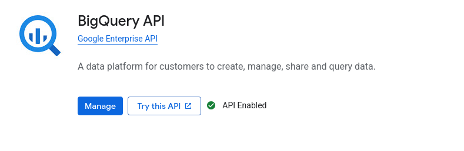
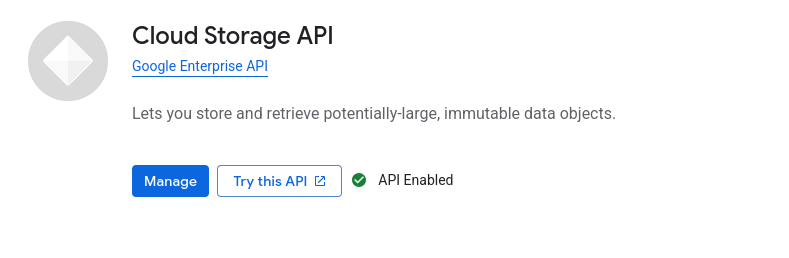

# 📊 Weather Data Pipeline & Reporting For EU Capitals


## 📑 Table of Contents

### 📖 1. Project Overview  
1.1 Goal of the Project  
1.2 Meteostat Data Source  

### ⚙️ 2. Data Pipeline  
2.1 Data Ingestion (01_ingest)  
2.2 Data Processing (02_spark)  
2.3 Data Modeling & Reporting (03_dbt)  
2.4 Report Generation  

### 🛠️ 3. Installation  
3.1 Google Cloud Setup  
3.2 Create a New Project  
3.3 Create a Service Account (User)  
3.4 Setup BigQuery  
3.5 Create Cloud Storage Bucket  
3.6 Configure config.json  
3.7 Assign Roles (Permissions)  
3.8 Download Credentials  
3.9 Region Must Match  
3.10 Enable APIs  
3.11 Install Docker  
3.12 Run Pipeline  
3.13 Output  
3.14 Notes 

### 📊 4. Data Availability Disclaimer


---


## 📖 1. Project Overview

The goal of this project is to generate a structured and insightful **weather report** based on historical data for Europian capitals.

To achieve this, we first collect weather data from **[Meteostat](https://meteostat.net/)** using their Python library. Meteostat provides a convenient way to access historical weather data for various locations around the world. While this project uses a simplified subset of their capabilities, the platform itself is powerful enough to support much more advanced use cases — from detailed analytics to full-scale data-driven applications built on top of their API.


---

## ⚙️ 2. Data Pipeline

The project is organized as a small data pipeline composed of three main stages:

### 2.1. Data Ingestion (`01_ingest`)

* Weather data is fetched from Meteostat
* Data is stored as **CSV files**
* Files are uploaded to **Google Cloud Storage (GCS)**

### 2.2. Data Processing (`02_spark`)

* CSV files are processed using **Apache Spark**
* Data is cleaned and transformed
* Converted into **Parquet format** (optimized for analytics)
* Final datasets are loaded into **BigQuery**

### 2.3. Data Modeling & Reporting (`03_dbt`)

* **dbt** is used to create analytical models (views) in BigQuery
* These models represent the final, structured data

### 2.4. 📄 Report Generation

Once the data is prepared:

* A Python script queries the **dbt models in BigQuery**
* The retrieved data is formatted and transformed
* A **PDF report** is generated using ReportLab
* The final report is uploaded to **Google Cloud Storage**


This approach demonstrates a complete **data engineering workflow**, from raw data ingestion to a final, user-friendly report.

---


## 🛠️ 3. Installation

This section will guide you through setting up all required components to run the project successfully.
Follow each step carefully to ensure proper configuration of cloud resources and local environment.


### 🌐 3.1. Google Cloud Setup


Go to: https://console.cloud.google.com/

Decide in which region to store your data. Example regions:

* `europe-west1` (Belgium)
* `europe-central2` (Poland)
* `us-central1` (Iowa)

### 3.2. Create a New Project

* Go to Google Cloud Console
* Create a new project


### 3.3. Create a Service Account (User)

* Navigate to **IAM & Admin → Service Accounts**
* Create a new service account for your project


### 3.4. Setup BigQuery

* Open **BigQuery**
* You will see your project as a dataset container
* Create a **dataset** inside the project

👉 Save these values (you will need them later):

* BigQuery Project ID
* Dataset Name
* Region


### 3.5. Create Cloud Storage Bucket

* Go to **Cloud Storage → Buckets**
* Create a new bucket

⚠️ **IMPORTANT:**
Bucket MUST be in the **same region** as BigQuery data.

👉 Save:

* Bucket name


### 3.6. Configure `config.json`

Inside the `credentials` directory, create/update `credentials/config.json` file:

```json
{
  "bucket": "your-bucket-name",
  "bigquery_project": "your-project-id",
  "bigquery_dataset": "your-dataset",
  "region": "your-region"
}
```


### 3.7. Assign Roles (Permissions)

Go to your service account and add roles to your user:

* BigQuery Data Editor
* BigQuery Job User
* BigQuery User
* Storage Admin


### 3.8. Download Credentials

* Download JSON key for the service account
* Rename it to:

```bash
credentials.json
```

* Place it in the `credentials/` directory


### 3.9. ⚠️ REGION MUST MATCH

> **🚨 RED ALERT:**
> The region for **BigQuery** and **Cloud Storage** MUST be the same.
> Otherwise, the application will NOT work.


### 3.10. Enable APIs

Go to:
https://console.cloud.google.com/

Enable:

* BigQuery API



* Cloud Storage API




### 🐳 3.11. Install Docker

Install Docker on your machine:
https://docs.docker.com/get-docker/


### 3.12. Run Pipeline

Run commands **one by one (order is important):**

```bash
docker compose run --rm ingest
docker compose run --rm spark
docker compose run --rm dbt
```

### 📁 3.13. Output

After successful execution:

* Go to your **Cloud Storage bucket**
* Navigate to:

```text
reports/report.pdf
```

👉 This PDF contains all calculated weather data.


## 📝 3.14. Notes


* Ensure environment variables are correctly set
* Check logs if any step fails
* Do NOT run Docker commands in parallel.

---


# 📊 4. Data Availability Disclaimer

Weather data in this project is sourced from historical records that start from **01 January 1970**. However, data availability is not uniform across all cities and time periods.

- Some cities have **continuous data from 1970 to 2025**
- Other cities only have data starting from later years (e.g. 2010–2025)

Additionally, even when data exists for a given period, it may be **incomplete**:

- Core metrics such as **temperature, minimum temperature, and maximum temperature** are generally available
- Other metrics (such as **snow, precipitation, humidity, wind, etc.**) are **optional and may be missing**
- Some weather stations start reporting additional metrics only after a certain year

Because of these inconsistencies, results should be interpreted with caution.  
This does not reflect data inaccuracy, but rather **uneven historical coverage across locations and time periods**.


---


## 🔗 Author

- [Novak Urosevic](https://github.com/novakurosevic)


