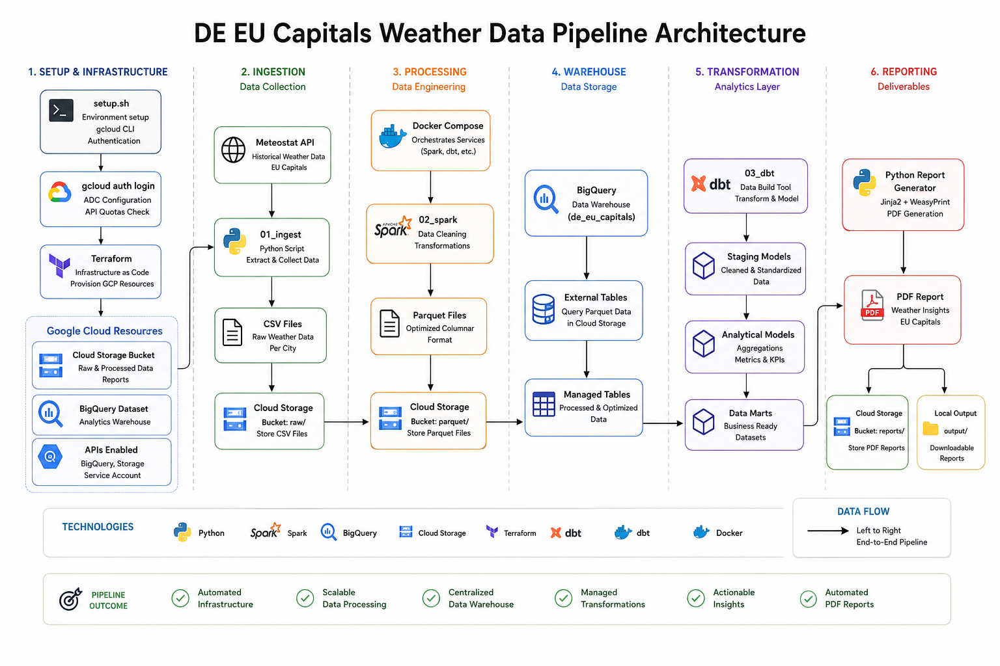

# 📊 Weather Data Pipeline & Reporting For EU Capitals

---

# 📑 Table of Contents

### 📖 1. Project Overview
1.1 Goal of the Project  
1.2 Data Source  
1.3 Technology Stack

### ⚙️ 2. Pipeline Architecture
2.1 Data Flow  
2.2 Terraform Infrastructure  
2.3 Data Processing Flow

### 🛠️ 3. Installation & Setup
3.1 Prerequisites  
3.2 Google Cloud Setup  
3.3 Clone Repository  
3.4 Run Setup Script  
3.5 Authentication Permissions

### 🚀 4. Pipeline Execution

### 📁 5. Output

### 📊 6. Data Availability Disclaimer

### 👨‍💻 7. Author

---

# 📖 1. Project Overview

This project builds a complete Data Engineering pipeline that collects historical weather data for European capitals, processes it with Apache Spark, models it using dbt, and generates a final PDF weather report.

The goal is to demonstrate a realistic end-to-end cloud data platform using modern Data Engineering tools and practices.

### 🏗️ Architecture Overview



---

## 1.1 Data Source

Weather data is collected using:

- Meteostat Python SDK
- Historical weather station records
- European capital city metadata

Official website:

https://meteostat.net/

---

## 1.2 Technology Stack

| Category | Technology |
|-----------|-----------|
| Infrastructure | Terraform |
| Cloud Platform | Google Cloud Platform |
| Storage | Google Cloud Storage |
| Data Warehouse | BigQuery |
| Processing | Apache Spark |
| Transformation | dbt |
| Programming Language | Python |
| Containerization | Docker |
| Orchestration | Docker Compose |
| Reporting | ReportLab |

---

# ⚙️ 2. Pipeline Architecture

## 2.1 Data Flow

```text
🌦️ Meteostat
      │
      ▼
📄 CSV
      │
      ▼
☁️ Google Cloud Storage
      │
      ▼
⚡ Apache Spark
      │
      ▼
🗂️ Parquet
      │
      ▼
📊 BigQuery
      │
      ▼
🔷 dbt Models
      │
      ▼
📄 PDF Report
      │
      ▼
☁️ Cloud Storage
      │
      ▼
💻 Local Download
```

## 2.2 Infrastructure Provisioning

Terraform automatically creates:

- Google Cloud Storage Bucket
- BigQuery Dataset
- Required Google APIs

No manual infrastructure setup is required.

---

## 2.3 Pipeline Components

### Terraform Container

Responsible for:

- Infrastructure provisioning
- API activation
- Bucket creation
- Dataset creation

### Ingestion Container

Responsible for:

- Downloading weather data
- Uploading raw files to GCS

### Spark Container

Responsible for:

- Cleaning data
- Transforming CSV → Parquet
- Loading data into BigQuery

### dbt Container

Responsible for:

- Data modeling
- View creation
- PDF report generation
- Uploading report to GCS
- Downloading report locally

---

# 🛠️ 3. Installation & Setup

## 3.1 Prerequisites

Install:

### Docker

https://docs.docker.com/get-docker/

### Google Cloud CLI

https://cloud.google.com/sdk/docs/install

Verify installation:

```bash
docker --version
gcloud --version
```

---

## Windows Users

This project uses Bash scripts.

Windows users must run the project using one of:

- Git Bash
- WSL2 (recommended)

Running directly from Command Prompt or PowerShell is not supported.

---

## 3.2 Google Cloud Setup

Create a new Google Cloud Project:

https://console.cloud.google.com/

Save your:

- Project ID

Example:

```text
weather-project-123456
```

---

## 3.3 Clone Repository

```bash
git clone https://github.com/novakurosevic/de-eu-capitals-weather-data.git

cd de-eu-capitals-weather-data
```

---

## 3.4 Run Setup Script

Give execute permission:

```bash
chmod +x setup.sh
```

Run:

```bash
./setup.sh
```

The script will:

- Authenticate with Google Cloud
- Configure quota project
- Generate Terraform variables
- Create infrastructure
- Generate configuration files
- Run ingestion
- Run Spark processing
- Run dbt models
- Generate PDF report
- Download report locally

---

## 3.5 Authentication Permissions

When Google Cloud login opens in your browser, BOTH permissions must be accepted.

Select:

✅ See, edit, configure and delete your Google Cloud data

✅ View and sign in to your Google Cloud SQL instances

Example:


Without both permissions some API calls may fail.

---

# 🚀 4. Pipeline Execution

The entire project is executed with a single command:

```bash
./setup.sh
```

No additional manual steps are required.

Terraform, Spark, dbt and reporting are executed automatically.

---

# 📁 5. Output

After successful execution:

## Google Cloud Storage

```text
reports/report.pdf
```

## Local Machine

```text
output/report.pdf
```

Generated report includes:

- Temperature statistics
- Weather trends
- Capital city comparisons
- Historical summaries

---

# 📊 6. Data Availability Disclaimer

Weather data in this project is sourced from historical records beginning on:

```text
01 January 1970
```

Data coverage varies between locations.

Some cities have:

- Full historical coverage

Others have:

- Partial coverage
- Missing years
- Missing metrics

Examples of potentially missing metrics:

- Humidity
- Snow
- Precipitation
- Wind speed
- Sunshine duration

This reflects limitations of historical weather station reporting and not processing errors within the project.

---


## 🔗 Author

- [Novak Urosevic](https://github.com/novakurosevic)


